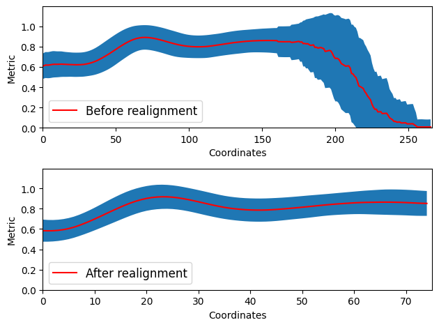

# Diffusion profile realignment (dpr)

An example and assorted implementation from the manuscript **Reducing variability in along-tract analysis with diffusion profile realignment**.
Have a look at the [example](example.ipynb) on how to use the package and run it on a small example dataset.

### A quick example from the command line

There is also a command line version for easy usage, here in an example for the AFD metric on the left arcuate fasciculus.
The text file is already ordered in increasing order for each subject, which have the same distance between every point and are already zero padded accordingly.

We also supply the **--exploredti** option to remove the header column, **--do_graph** to save a png file with the results.

We finally resample everything to 75 points with **--points 75**.

The **-f** option overwrites the output files and the **-v** option prints useful informative messages throughout (and are optional).

~~~bash
dpr datasets/af_left_AFD.txt datasets/af_left_AFD_realigned.txt --exploredti --do_graph -f -v --points 75
~~~

The output ```datasets/af_left_AFD_realigned.txt``` is a text file where each line is a subject and each column is a different point of the along tract analysis.

We also get a png file ```datasets/af_left_AFD_realigned.png``` with the before/after realignment process.



Note how the zero padding present in the original data is decreasing the metrics as less and less subjects are present.
The realigned metric is instead using padding with Nans, remember to consider/keep track of it in subsequent analysis as needed.

### Datasets and reference

The main reference is 
~~~
Samuel St-Jean, Maxime Chamberland, Max A. Viergever, Alexander Leemans,
Reducing variability in along-tract analysis with diffusion profile realignment,
NeuroImage, 2019. ISSN 1053-811
~~~

The data is also available at https://zenodo.org/record/2483169.

The manuscript is also available at https://www.sciencedirect.com/science/article/pii/S1053811919305014.
