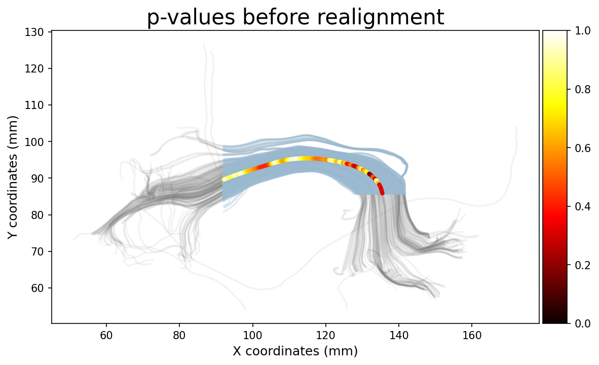
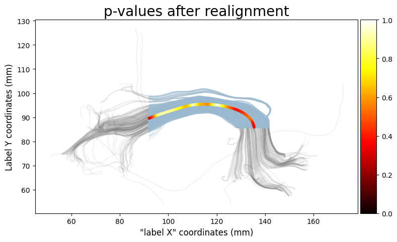

# Diffusion profile realignment (dpr)

An example and assorted implementation from the manuscript **Reducing variability in along-tract analysis with diffusion profile realignment**.
Have a look at the [example](example.ipynb) on how to use the package and run it on a small example dataset.

To install the package, just run
~~~
pip install dpr
~~~

The documentation is available at https://dpr.readthedocs.io.

### The matlab version

There is also a shiny new version written in matlab, with an assorted example, available in the [matlab](matlab) folder.
Feel free to check out and edit the functions as needed for your own usage.

### A quick example from the command line

There is also a command line version for easy usage, here in an example for the AFD metric on the left arcuate fasciculus.
The text file is already ordered in increasing order for each subject, which have the same distance between every point and are already zero padded accordingly.

We also supply the **--exploredti** option to remove the header column, **--do_graph** to save a png file with the results.

We finally resample everything to 75 points with **--points 75**.

The **-f** option overwrites the output files and the **-v** option prints useful informative messages throughout (and are optional).

~~~bash
dpr datasets/af_left_AFD.txt datasets/af_left_AFD_realigned.txt --exploredti --do_graph -f -v --points 75
~~~

The output ```datasets/af_left_AFD_realigned.txt``` is a text file where each line is a subject and each column is a different point of the along tract analysis.

We also get a png file ```datasets/af_left_AFD_realigned.png``` with the before/after realignment process.


Note how the zero padding present in the original data is decreasing the metrics as less and less subjects are present.
The realigned metric is instead using padding with Nans, remember to consider/keep track of it in subsequent analysis as needed.

### Visualizing the results

We can also draw the p-values (computed separately) over the bundle using the script ```dpr_make_fancy_graph```.
This requires the original coordinates, the truncated version between rois and the coordinates to the representative streamline.

~~~bash
dpr_make_fancy_graph datasets/af_left_pval_unaligned.txt datasets/af_left_coordinates.txt datasets/af_left_truncated_coordinates.txt datasets/af_left_average_coordinates.txt 0,2 pvals_unaligned.png --title 'p-values before realignment' -f
dpr_make_fancy_graph datasets/af_left_pval_realigned.txt datasets/af_left_coordinates.txt datasets/af_left_truncated_coordinates.txt datasets/af_left_average_coordinates.txt 0,2 pvals_realigned.png -f
~~~

And this is the results




### Datasets and reference

The main reference is

~~~
Samuel St-Jean, Maxime Chamberland, Max A. Viergever, Alexander Leemans,
Reducing variability in along-tract analysis with diffusion profile realignment,
NeuroImage, 2019. ISSN 1053-811
~~~

The data is also available at https://zenodo.org/record/2483169.

The open access manuscript is also available at https://www.sciencedirect.com/science/article/pii/S1053811919305014.

To refer to a specific version of the code, everything is also archived over at https://zenodo.org/record/3248894.
